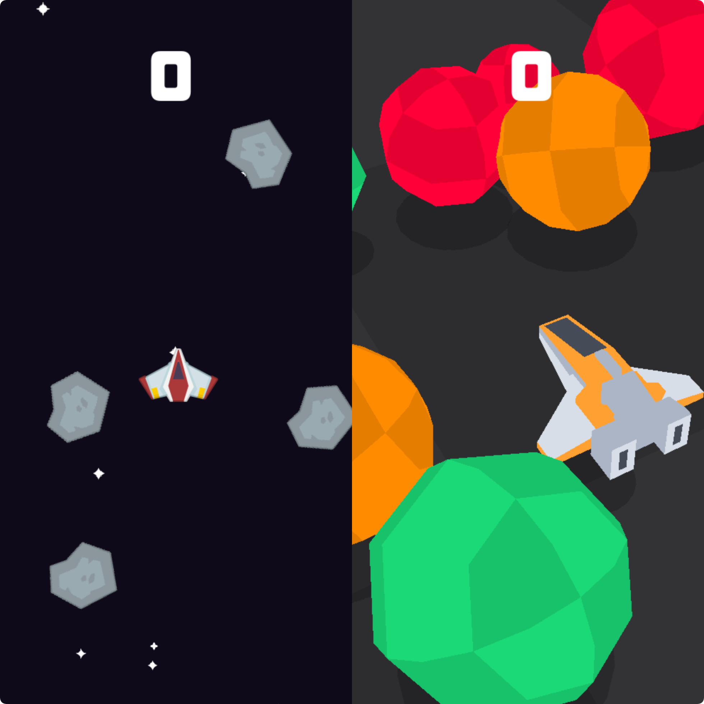

# SPACE SHOOTER GAME

    <em>
        Space Shooter is a thrilling game crafted with the Raylib library, renowned for its robust support of both 2D and 3D environments. In 2D mode, players are immersed in a fast-paced arcade experience, piloting a spaceship through vividly rendered galactic terrains while evading obstacles and confronting waves of adversaries. Transitioning to 3D mode, the game elevates the adventure with a richly detailed outer space setting, featuring realistic depth and dynamic battles against enemy fleets and asteroids. The seamless integration of these modes highlights Raylib's exceptional versatility and capability, providing a sophisticated and immersive gaming experience that resonates with both nostalgic arcade fans and modern gaming enthusiasts.
    </em>

